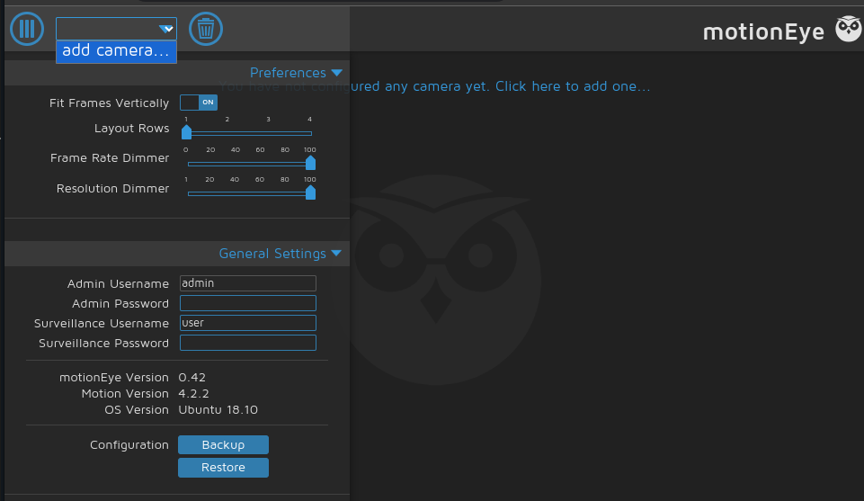
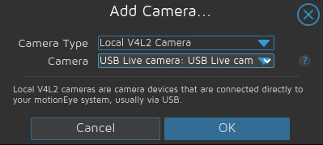

# OSTree system and podman-managed APPs lifecycle demo

## Background 

TBD


In this demo, we will explore:

* TBD 


References:
- [Red Hat official documentation for Microshift](https://access.redhat.com/documentation/en-us/red_hat_build_of_microshift/4.13)
- [Red Hat official documentation for RHEL OSTree](https://access.redhat.com/documentation/en-us/red_hat_enterprise_linux/9/html-single/composing_installing_and_managing_rhel_for_edge_images/index)
- [Red Hat Device Edge introduction](https://cloud.redhat.com/blog/introducing-the-new-red-hat-device-edge)
- (Red Hat internal) [Red Hat Device Edge slide deck](https://docs.google.com/presentation/d/1FKQDHrleCPuE0e36UekzXdkw86wNDx16dSgllXj-swY/edit?usp=sharing)
- [OSTree based Operating Systems article](https://luis-javier-arizmendi-alonso.medium.com/a-git-like-linux-operating-system-d84211e97933)
- [Image Builder quickstart bash scripts](https://github.com/luisarizmendi/rhel-edge-quickstart)
- [Ansible Collection for OSTree image management](https://github.com/redhat-cop/infra.osbuild)
- [Ansible Collection for Microshift management](https://github.com/redhat-cop/edge.microshift)

<br><br>

<hr style="border:2px solid gray">

## Pre-requisites
<hr style="border:2px solid gray">

You could use baremetal servers for this demo but you can run it too with just a couple of VMs running on your laptop (Image Builder and edge device).

You need an active Red Hat Enterprise Linux subscription.

<br><br>

<hr style="border:2px solid gray">

## Demo preparation

<hr style="border:2px solid gray">


BEFORE delivering the demo, you have to complete these preparation steps.

### Preparing the Image Builder

You need a subscribed [Red Hat Enterprise Linux 9](https://access.redhat.com/downloads/content/479/ver=/rhel---9/9.1/x86_64/product-software) system (minimal install is enough) with at least 2 vCPUs, 4 GB memory and 50 GB disk.

If you don't want to use `root`, be sure that the user has [passwordless sudo access](https://developers.redhat.com/blog/2018/08/15/how-to-enable-sudo-on-rhel).


### Preparing your laptop

Your will need to:

* Install Ansible

> laptop
```
dnf install -y ansible
```

* Download the `infra.osbuild` and `edge.microshift` Ansible collections

> laptop
```
ansible-galaxy collection install -f git+https://github.com/redhat-cop/infra.osbuild --upgrade
ansible-galaxy collection install -f git+https://github.com/redhat-cop/edge.microshift --upgrade

```

* Modify the Ansible `inventory` file with your values

* Copy your public SSH key into the Image Builder system, so you can open passwordless SSH sessions with the user that you configured in your Ansible inventory. (double check .ssh and authorized_keys permissions in case you are still asked for password after copying the key).

> laptop
```
ssh-copy-id <user>@<image builder IP>
```

* If you are using your laptop as hypervisor, be sure that you have at least 2 vCPU, 1.5GB memory and 20 GB disk free to create the Edge device VM (in addition the Image Builder VM that you should have already up and running).


### Preparing the OSTree images

You will need to prepare the Microshift image before running the demo since it takes some time to complete.

As part of the image preparation, you will be injecting your **pull secret** as an Ansible variable. Although you could just create a plain variable in vars/main.yaml it's highly recomended to encrypt sensitive infomation, so it's better to [Ansible Vault](https://docs.ansible.com/ansible/latest/vault_guide/index.html) by creating the encrypted variable file (protected by a password that you configure) using the following command:

> laptop
```
ansible-vault create vars/secrets.yml
```

**_NOTE:_** *Remember to include `--ask-vault-pass` when you try to run your Ansible playbooks containing Ansible Vault encrypted files*


By default a test app will be deployed along with microshift. If you want to skip that step just comment out the `microshift_test_app_template` line in cars/main.yaml.


Run the following Ansible Playbook:

> laptop
```
ansible-playbook -vvi inventory --ask-vault-pass playbooks/00-preparation-ostree.yml
```

It will:
* Install Image Builder
* Create the OSTree Image with Microshift

Once the Ansible Playbook is finished, you will see the URL where the ISO is published in the last Ansible `debug` message. Download it to the system where you will create the Edge device VM.


<br><br>

<hr style="border:2px solid gray">

## Demo steps

<hr style="border:2px solid gray">

TBD

<br>
<br>

### Step 0 - xxxxxxxxxxxxxxxxxxxx

---
**Summary**

TBD

---

TBD


### BONUS - Using attached Hardware from Microshift
---
**Summary**

Sometimes you will need to use localy connected hardware to your edge device. In the following example we will connect a webcame to our device running microshift and deploy an application that makes use of it.

---

**_NOTE:_** *If you are using a VM you could redirect the webcam port to the VM*

We wll be using the APP [Motioneye](https://github.com/motioneye-project/motioneye) to manage and view the webcamera stream. 

One important point is that we will need to run the application using a privileged POD in order to access the the locally attached hardware. This is configured in this case in three steps 

1. Create the namespace [enforcing the namespace pod security](https://kubernetes.io/docs/tasks/configure-pod-container/enforce-standards-namespace-labels/) to privileged using the `pod-security.kubernetes.io/enforce: privileged` label as you can see in the [namespace manifest](../../APPs/motioneye/k8s/namespace.yaml)

```
oc create -f ../../APPs/motioneye/k8s/namespace.yaml
```

2. Create an specific serviceAccount for running privileged PODs in that namespace using the [SCC manifest](../../APPs/motioneye/k8s/scc.yaml)

```
oc create -f ../../APPs/motioneye/k8s/scc.yaml
```

3. Create the Persistent volumes and application deployment including `spec/template/spec/serviceAccountName: privileged-sa` and `spec/template/spec/containers/securityContext/privileged: true` as you can see in the [application deployment manifest](../../APPs/motioneye/k8s/motioneye-deployment.yaml). You can see 

```
oc create -f ../../APPs/motioneye/k8s/motioneye-pv-claims.yaml
oc create -f ../../APPs/motioneye/k8s/motioneye-deployment.yaml
```

Once that's done you can use `oc get pod -n motioneye` and check when the POD is in `running` state.

4. Create the service and the Route. In this case the [service manifest](../../APPs/motioneye/k8s/motioneye-service.yaml) also createsa nodeport but if you want to use it for testing propuses remember to open the tcp port by running ` sudo firewall-cmd  --add-port=31180/tcp && sudo firewall-cmd  --add-port=31180/tcp`.

```
oc create -f ../../APPs/motioneye/k8s/motioneye-service.yaml
oc create -f ../../APPs/motioneye/k8s/motioneye-route.yaml

```

5. At this point you should be able to jump into the app route (`oc get route -n motioneye`) and you will see the log page. Use the `admin` username with an empty password and you should be able to jump into the application but no cameras are configured.

You will need to create a new camera stream by opening the menu (3 line icon on top left corner) and select `add camera` in the dropdown menu:



Then be sure that you have selected the Camera Type `Local V4L2 Camera` and the choose one of the cameras that appear the button dropdown menu:




Few seconds after that you will see the camera image, smile!
